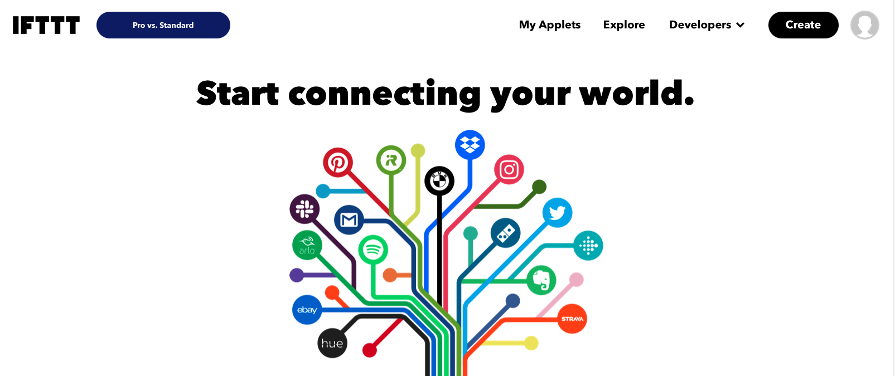
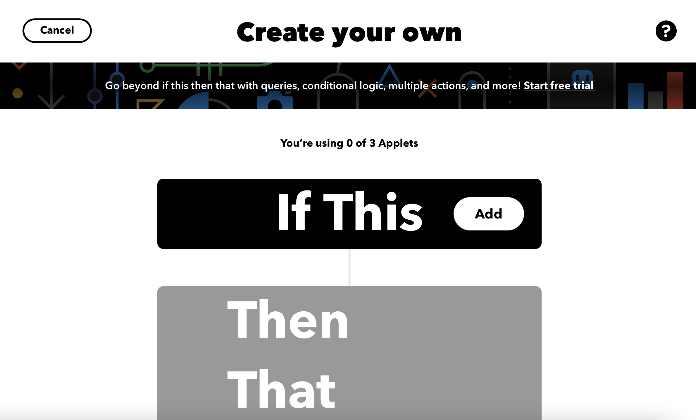
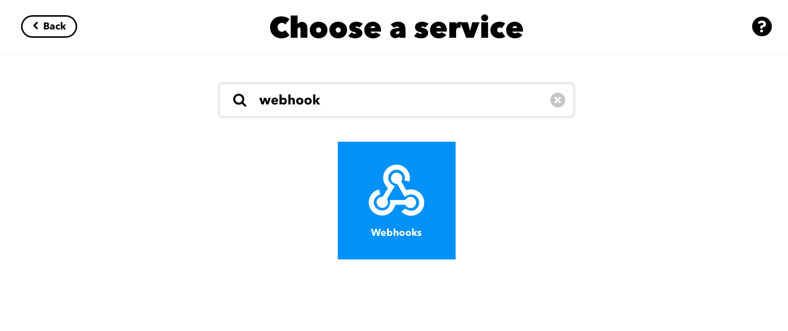
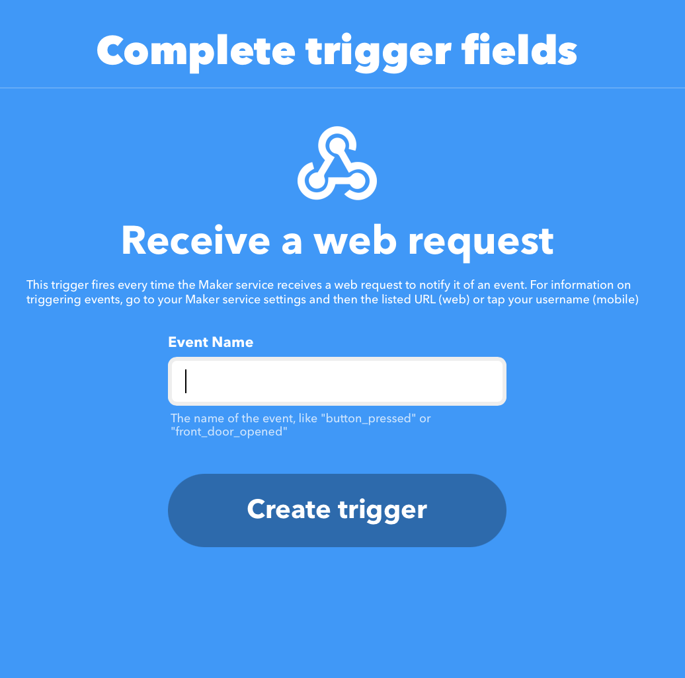
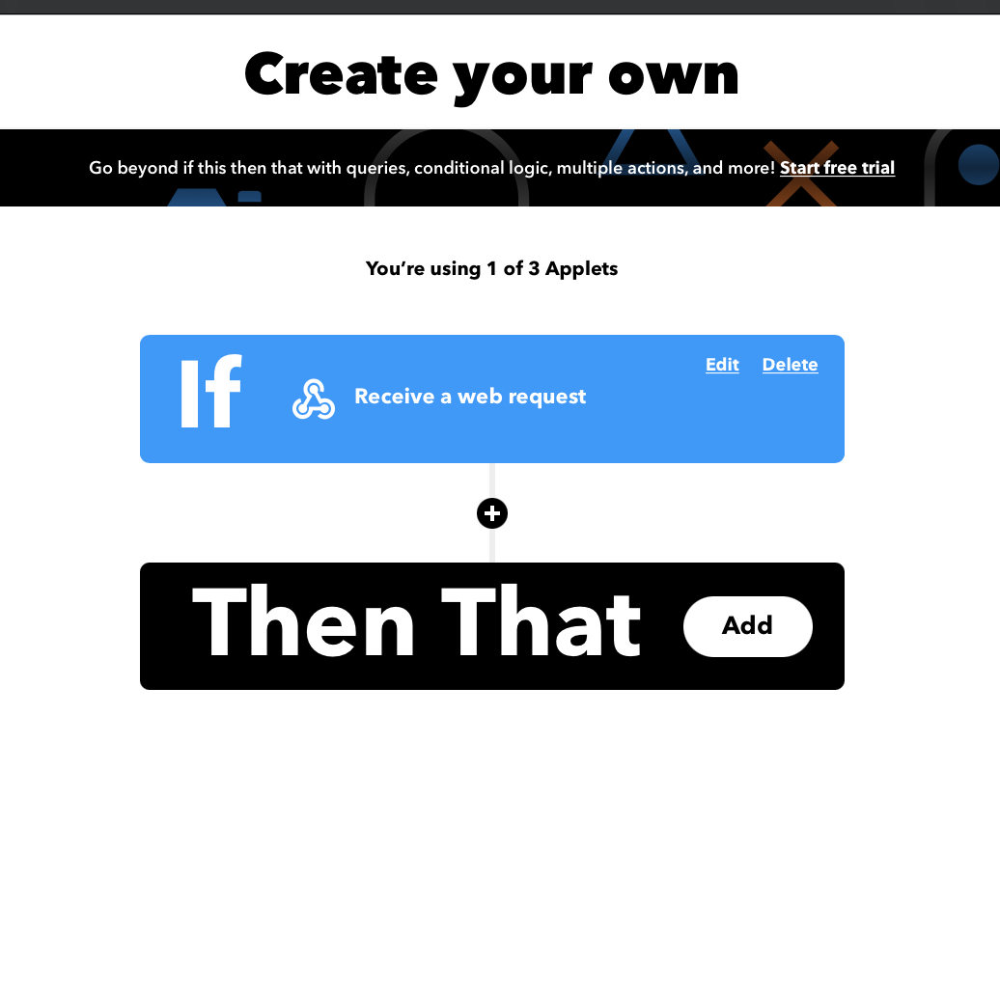
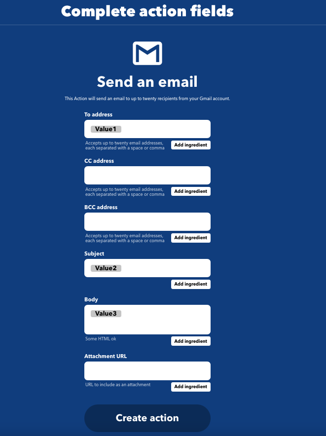
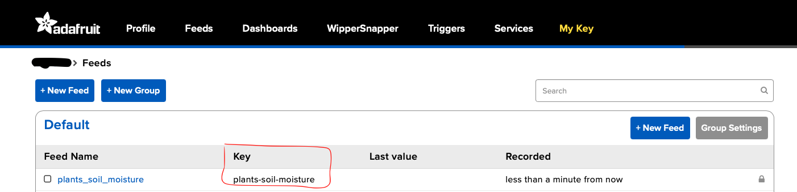

# Monitor the soil moisture of your plants with Adafruit IO
Adafruit IO allows to visualize the measurements. An email is sent (using an IFTTT webhook) when watering is required. 

## Cloning
`git clone --recurse-submodules https://github.com/m0by314/plant_soil_moisture.git`

## Summary
 - [How it works](#How-it-works)
 - [Connect the soil moisture sensor](#Connect-the-soil-moisture-sensor)
 - [Calibrate moisture soil sensor](#Calibrate-moisture-soil-sensor)
 - [Create IFTTT webhooks](#Create-IFTTT-webhooks)
 - [Create Adafruit IO dashboard](#Create-Adafruit-IO-Dashboard)
 - [Setup](#Setup)
 - [Built with](#Built-with)


## How it works

The tool performs a measurement every 6 hours, in order to have the evolution of the soil moisture during the day.  
The data is stored on an Adafruit IO feed to be visualized in a dashboard.  

If the percentage of soil moisture is below than the threshold, an alert watering for your plant is sent by email using an IFTTT webhook.  

Between each measurement, the ESP goes into deep sleep mode.  

I use the Adafruit IO platform because the free account offers 10 feeds, (which allows to monitor 10 plants), 5 dashboards and the data are stored for 30 days 

## Connect the soil moisture sensor


## Calibrate moisture soil sensor
Before the first use, it is necessary to perform a calibration to ensure that the soil moisture sensor is working properly.

Leave the sensor in the open air to obtain the DRY_VALUE value (which corresponds to a relative humidity of 0%) then place the sensor in a glass filled with water to obtain the WET_VALUE value (which corresponds to a humidity of 100%). This will provide indicative values for establishing a scale for evaluating the results.

To start the application in calibration mode, simply change the value of the CALIBRATION constant to true in the config.h file (see [Setup](#Setup) to create config.h file)

## Create IFTTT webhooks

* Go to the link: https://ifttt.com/
* Then click on the "create" button 

* Then click on "add" in the "If This" section 

* Search for the "Webhooks" service

* Select trigger "Receive a web request"
 
* Define the event name (to keep aside it will be used in the configuration file) then create the trigger

* In the "Then that" section click on "add

* Search for the Gmail service
* Then select action "send an email"

* Complete action fields like this:



* Go to the following link to get your key: https://ifttt.com/maker_webhooks/settings   
The key is at the end of the URL
  


## Create Adafruit IO Dashboard

* See this link for create a feed: 
https://learn.adafruit.com/adafruit-io-basics-feeds/creating-a-feed
* See this link for create a feed: 
https://learn.adafruit.com/adafruit-io-basics-dashboards/creating-a-dashboard

* Get your Adafruit Key:
Click on the tab "My Key"


* Get your Adafruit feed key:
Go to the feeds page to see the key of your feed



## Setup 


* First copy the template:  
`cp config_template.h config.h`

* Configure the following variables with your credentials:  
```
/* Soil sensor */
#define MOISTURE_SENSOR_PIN 36 
#define DRY_VALUE "value obtained in air" 
#define WET_VALUE "value obtained after immersing it in water" 

/* WIFI Setting */
#define WIFI_SSID "YOUR_WIFI_SSID"     /* Replace with your wifi ssid. */
#define WIFI_PWD "YOUR_WIFI_PASSWORD"  /* Replace with your wifi password */

/* Plant name */
#define PLANT_NAME "YOUR PLANT NAME"   /* Replace with your plant name, use for the subject of the mail.*/

/* Adafruit IO settings */
#define IO_USERNAME "YOUR ADAFRUIT USERNAME" /* Replace with your adafruit username. */
#define IO_KEY "YOUR ADAFRUIT KEY"           /* Replace with your adafruit key.      */
#define IO_FEED_NAME "YOUR FEED NAME"        /* Replace with your adafruit feed name. */

// IFTTT Setting
#define IFTTT_KEY  "YOUR_IFTTT_KEY"          /* Replace with your unique IFTTT Key, can be obtained at this link: https://ifttt.com/maker_webhooks/settings. */
#define IFTTT_EVENT_NAME "YOUR_EVENT_NAME"  /* Replace with your IFTTT event name. */

/* Mail Setting */
#define MAILTO "YOUR_MAIL" /* Replace with your email. */

/* Moisture alert threshold */
#define THRESHOLD "YOUR_MOISTURE_THRESHOLD" /* Replace with your moisture threshold alert */
```

## Built with

* ESP32 NodeMCU Module WLAN WiFi Development Board with CP2102 
* Moisture sensor YL69 and module HC-38
