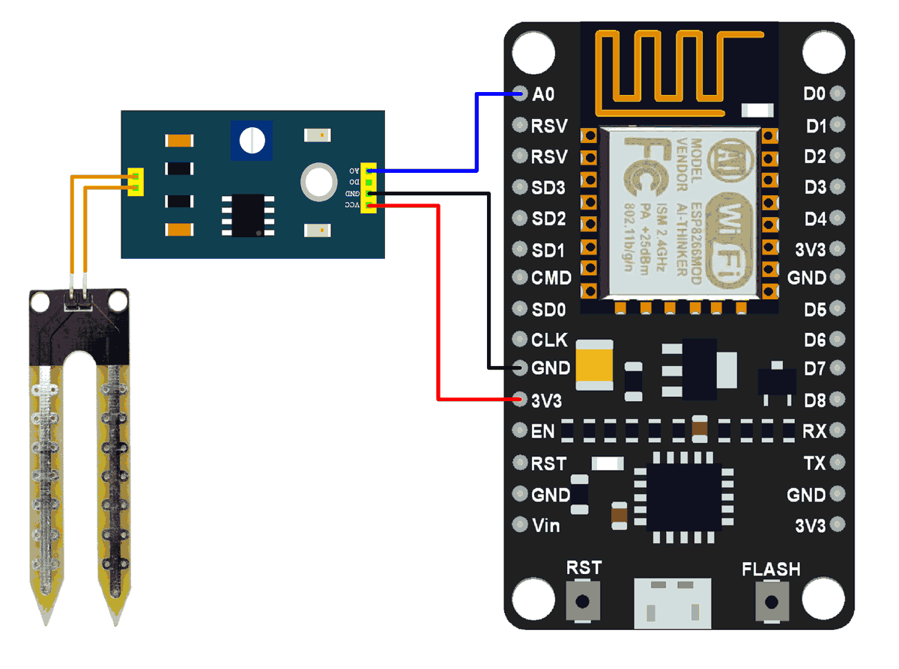

# Plants soil moisture monitoring
Tool to plants soil moisture monitoring with Adafruit IO dashboard and an ESP32 with soil moisture sensor.

## Summary
 - [How it works](#How-it-works)
 - [Connect the soil moisture sensor](#Connect-the-soil-moisture-sensor)
 - [Calibrate your soil moisture sensor](#Calibrate-your-soil-moisture-sensor)
 - [Create Adafruit IO dashboard](#Create-Adafruit-IO-Dashboard)
 - [Setup](#Setup)
 - [Built with](#Built-with)


## How it works

The tool performs a measurement every 6 hours, in order to have the evolution of the soil moisture during the day.  
The data is stored on an Adafruit IO feed to be visualized in a dashboard. 

Between each measurement, the ESP goes into deep sleep mode.  

## Connect the soil moisture sensor



## Calibrate your soil moisture sensor 

For more accuracy, the sensor should be calibrated with a sample of the plant's soil. 
Place a dry soil sample in a cup and use the calibration program available at this link: 
https://www.hackster.io/m0by314/calibrate-soil-moisture-sensor-3c3a39 

Once the calibration is finished you will receive an email with the threshold for dry soil. 

Water the sample and restart the program to obtain the threshold for wet soil.


## Create Adafruit IO Dashboard

* See this link for create a feed: 
https://learn.adafruit.com/adafruit-io-basics-feeds/creating-a-feed
* See this link for create a feed: 
https://learn.adafruit.com/adafruit-io-basics-dashboards/creating-a-dashboard

* Get your Adafruit Key:
Click on the tab "My Key"


* Get your Adafruit feed key:
Go to the feeds page to see the key of your feed


## Setup 


* First copy the template:  
`cp config_template.h config.h`

* Configure the following variables with your credentials:  
```
/* 
Moisture Sensor Calibration 
See this link https://www.hackster.io/m0by314/calibrate-soil-moisture-sensor-3c3a39 for cabribrate moisture sensor 
*/ 
#define DRY_VALUE "YOUR DRY VALUE"   /* Replace with the value obtained in dry soil */
#define WET_VALUE "YOUR WET VALUE"   /* Replace with the value obtained in wet soil */

/* WIFI Setting */
#define WIFI_SSID "YOUR_WIFI_SSID"     /* Replace with your wifi ssid. */
#define WIFI_PWD "YOUR_WIFI_PASSWORD"  /* Replace with your wifi password */

/* Adafruit IO settings */
#define IO_USERNAME "YOUR ADAFRUIT USERNAME" /* Replace with your adafruit username. */
#define IO_KEY "YOUR ADAFRUIT KEY"           /* Replace with your adafruit key.      */
#define IO_FEED_NAME "YOUR FEED NAME"        /* Replace with your adafruit feed name. */
```

## Built with

* ESP32 NodeMCU Module WLAN WiFi Development Board with CP2102 
* Moisture sensor YL69 and module HC-38
